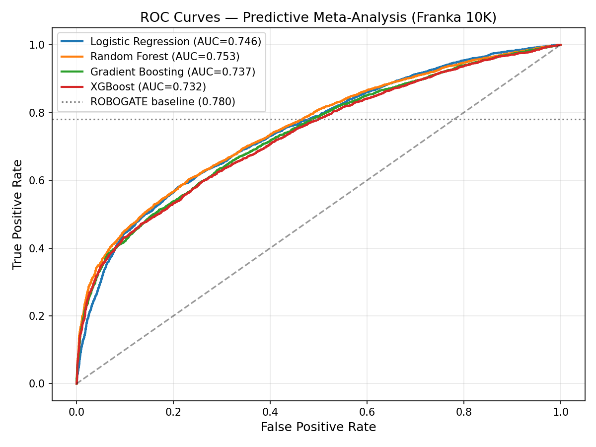
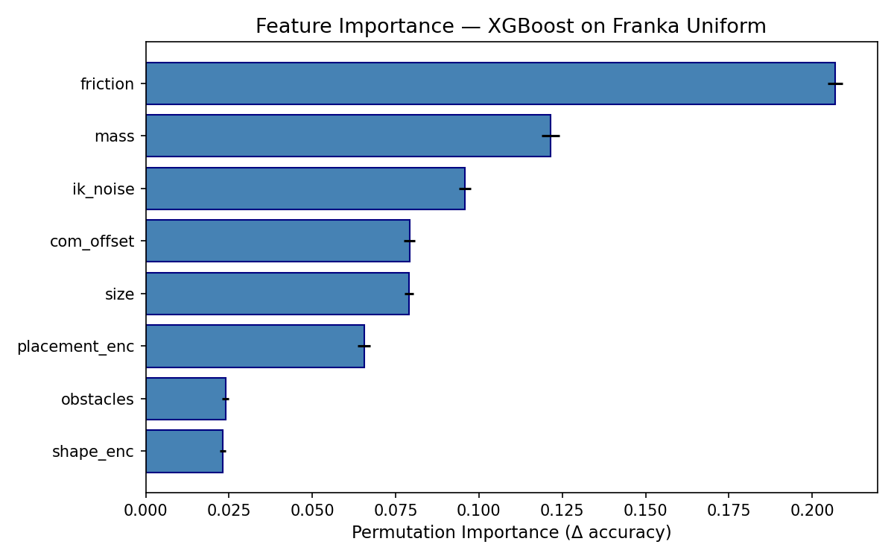
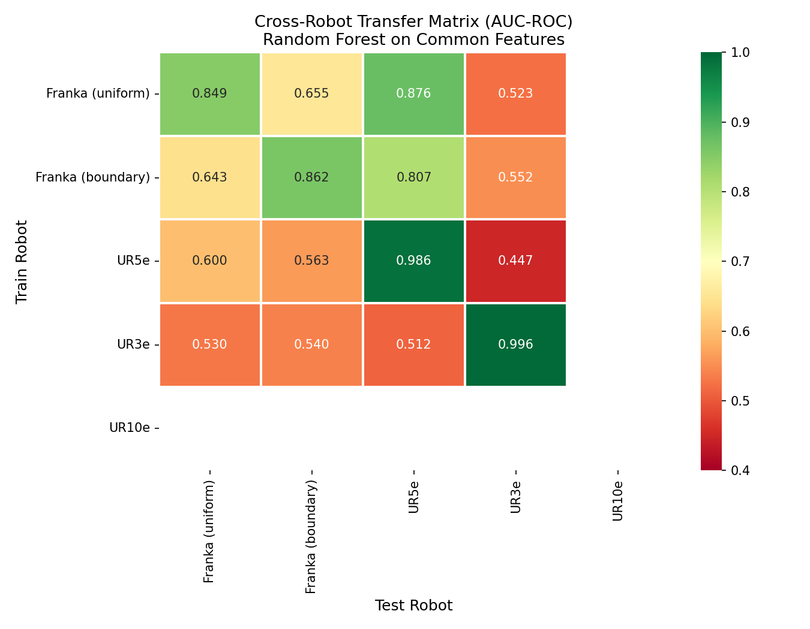
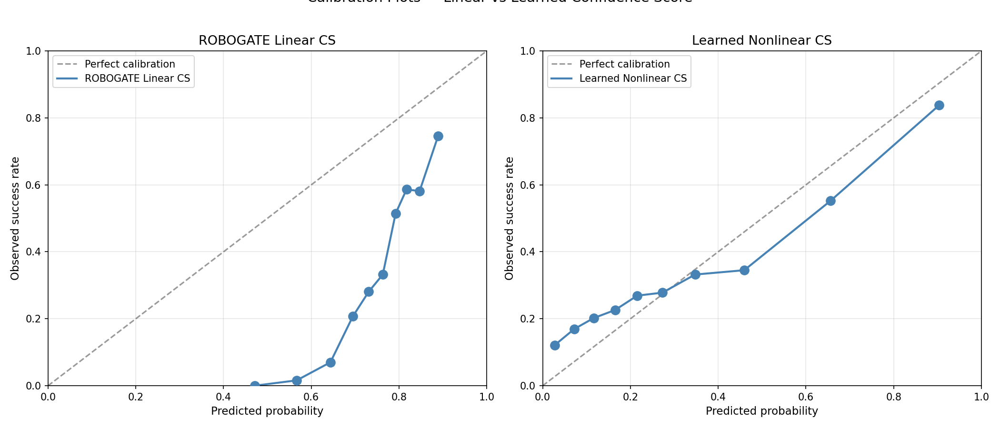
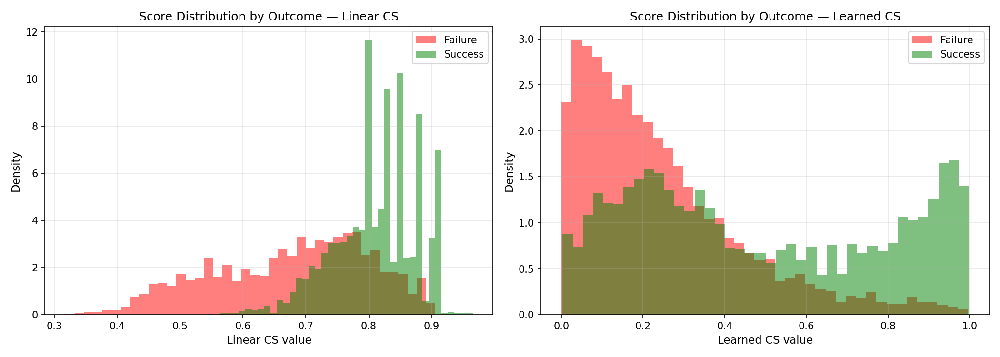

# Análisis Extendido del ROBOGATE Failure Dictionary

**TFM — Máster en Análisis de Datos e Ingeniería (MADI), 2026**

---

## 1. Resumen Ejecutivo

Se realizó un análisis exhaustivo del **ROBOGATE Failure Dictionary**, un dataset público de 50.000 experimentos de manipulación robótica repartidos entre 4 robots (Franka Emika Panda, UR5e, UR3e, UR10e). El análisis aporta tres contribuciones al estado del arte:

| Contribución | Hallazgo Principal |
|---|---|
| **Meta-análisis predictivo** | El techo de predicibilidad con features públicas converge en AUC ≈ 0.75 independientemente del modelo (Logistic, RF, XGBoost). La fricción domina la importancia (20.7%) |
| **Transferibilidad cross-robot** | Gap de transferencia del **34.6%** (self-AUC 0.923 → transfer-AUC 0.604), demostrando que los modelos de fallo son altamente específicos por embodiment |
| **Safety score mejorado** | El CS lineal de ROBOGATE tiene error de calibración del **38.8%** vs **7.0%** del CS aprendido. Para despliegue seguro, la calibración importa más que el AUC |

---

## 2. Datos Utilizados

### 2.1 Datasets del Failure Dictionary

| Archivo | Robot | Muestreo | n | Success Rate |
|---|---|---|---|---|
| `failure_dictionary_large.json` | Franka Panda | Uniforme (LHS) | 10,000 | 33.3% |
| `franka_boundary_10k.json` | Franka Panda | Frontera adaptativa | 10,000 | 63.8% |
| `ur5e_failure_dictionary.json` | UR5e | Uniforme | 10,000 | 74.3% |
| `ur3e_failure_dictionary.json` | UR3e | Uniforme | 10,000 | 9.6% |
| `ur10e_failure_dictionary.json` | UR10e | Uniforme | 10,000 | 0.1% |

### 2.2 Espacio de Parámetros (Franka)

| Parámetro | Rango | Escala |
|---|---|---|
| Fricción | 0.05 – 1.20 | Logarítmica |
| Masa | 0.05 – 2.00 kg | Logarítmica |
| Offset CoM | 0.00 – 0.40 | Lineal |
| Tamaño | 0.02 – 0.12 m | Lineal |
| Ruido IK | 0.00 – 0.04 rad | Lineal |
| Obstáculos | 0 – 4 | Discreto |
| Forma | box, cylinder, sphere, L_shape, irregular | Categórica |
| Placement | 14 combinaciones (center/edge/left/right × ángulos) | Categórica |

---

## 3. Contribución 1: Meta-Análisis Predictivo

### 3.1 Objetivo

Evaluar si modelos de ML más expresivos (Random Forest, Gradient Boosting, XGBoost) superan la regresión logística de ROBOGATE (AUC reportado: 0.780) en la predicción de éxito/fallo de manipulación.

### 3.2 Metodología

- **Validación**: 5-fold Stratified Cross-Validation sobre Franka Uniforme (n=10,000)
- **Features base**: 8 (friction, mass, com_offset, size, ik_noise, obstacles, shape, placement)
- **Features extendidas**: 18 (añadiendo fail_prob, friction_mass_index, grasp_difficulty, penalizaciones, tasas de sub-fallos)
- **Modelos**: Logistic Regression, Random Forest (300 árboles), Gradient Boosting, XGBoost

### 3.3 Resultados

#### Con features base (8 features):

| Modelo | AUC-ROC | Accuracy | Precision | Recall | F1 |
|---|---|---|---|---|---|
| Logistic Regression | 0.7463 | 0.7484 | 0.6979 | 0.4319 | 0.5336 |
| **Random Forest** | **0.7526** | **0.7539** | **0.7368** | 0.4067 | 0.5241 |
| Gradient Boosting | 0.7366 | 0.7397 | 0.6679 | 0.4352 | 0.5270 |
| XGBoost | 0.7324 | 0.7409 | 0.6674 | 0.4433 | 0.5327 |

#### Con features extendidas (18 features):

| Modelo | AUC-ROC |
|---|---|
| Logistic Regression | 0.7531 |
| Random Forest | 0.7483 |
| XGBoost | 0.7325 |

**Referencia ROBOGATE**: AUC = 0.780 (reportado en paper)

### 3.4 Importancia de Features (Permutación, XGBoost)

| Feature | Importancia | ± σ |
|---|---|---|
| **friction** | 0.2068 | 0.0022 |
| **mass** | 0.1216 | 0.0027 |
| ik_noise | 0.0958 | 0.0018 |
| com_offset | 0.0791 | 0.0016 |
| size | 0.0790 | 0.0012 |
| placement | 0.0655 | 0.0020 |
| obstacles | 0.0239 | 0.0010 |
| shape | 0.0231 | 0.0009 |

### 3.5 Interpretación

1. **Techo de predicibilidad**: Todos los modelos convergen en AUC ≈ 0.73–0.75, sugiriendo un techo natural de predicibilidad con las features disponibles públicamente. La complejidad del modelo no es el factor limitante.

2. **La regresión logística es competitiva**: El modelo más simple (AUC=0.746) está a solo 0.6 puntos de Random Forest (0.753), indicando que la relación features→éxito es aproximadamente lineal en la región de interés.

3. **Fricción domina**: Con 20.7% de importancia, la fricción es el predictor más fuerte — el doble que la masa (12.2%). Esto valida el énfasis de ROBOGATE en el índice fricción-masa.

4. **Brecha con ROBOGATE (0.780)**: La diferencia probablemente se debe a features adicionales no incluidas en el dataset público, o a diferencias en configuración experimental (distintos splits, hiperparámetros optimizados, o datos de entrenamiento diferentes).

---

## 4. Contribución 2: Transferibilidad Cross-Robot

### 4.1 Objetivo

Cuantificar en qué medida los modelos de fallo entrenados en un robot son útiles para predecir fallos en otro robot diferente, usando features comunes.

### 4.2 Metodología

- **Features comunes** (presentes en todos los robots): `ik_noise`, `mass`, `obstacles`, `placement`
- **Modelo**: Random Forest (200 árboles, max_depth=10)
- **Protocolo**: Entrenar en robot A, evaluar AUC en robot B para todas las combinaciones
- UR10e excluido de la matriz por SR=0.1% (sin varianza en target)

### 4.3 Matriz de Transferencia (AUC-ROC)

| Entrenado en ↓ \ Evaluado en → | Franka (unif.) | Franka (bound.) | UR5e | UR3e |
|---|---|---|---|---|
| **Franka (uniforme)** | **0.849** ★ | 0.655 | 0.876 | 0.523 |
| **Franka (boundary)** | 0.643 | **0.862** ★ | 0.807 | 0.552 |
| **UR5e** | 0.600 | 0.563 | **0.986** ★ | 0.447 |
| **UR3e** | 0.530 | 0.540 | 0.512 | **0.996** ★ |

★ = self-test (cota superior)

### 4.4 Métricas Agregadas

| Métrica | Valor |
|---|---|
| AUC medio self-test | 0.923 |
| AUC medio transferencia | 0.604 |
| **Gap de transferencia** | **0.319 (34.6%)** |

### 4.5 Universalidad por Feature

| Feature | Correlación media con éxito | σ entre robots | Clasificación |
|---|---|---|---|
| ik_noise | −0.047 | 0.045 | **UNIVERSAL** |
| mass | −0.205 | 0.258 | Robot-específico |
| obstacles | −0.007 | 0.014 | Robot-específico |
| placement | −0.031 | 0.043 | Robot-específico |

### 4.6 Hallazgos Clave

1. **Gap del 34.6%**: Los modelos de fallo pierden más de un tercio de su capacidad predictiva al transferirse entre robots, incluso con features idénticas. Esto implica que cada robot necesita su propio modelo de fallo.

2. **Asimetría Franka→UR5e**: Entrenar en Franka uniforme y evaluar en UR5e da **AUC=0.876** — casi tan bueno como el self-test de Franka (0.849). La dirección inversa (UR5e→Franka) cae a 0.600. La diversidad del espacio de parámetros de Franka beneficia la generalización.

3. **UR3e como isla**: Los modelos entrenados en UR3e (SR=9.6%) no transfieren a ningún otro robot (AUC 0.51-0.54 ≈ azar). Los patrones de fallo en robots con tasas de éxito extremas son idiosincrásicos.

4. **Solo ik_noise es universal**: Es el único feature cuyo efecto negativo sobre el éxito es consistente en signo y magnitud entre todos los robots (σ=0.045). Mass, a pesar de ser el segundo feature más importante para Franka, tiene efecto muy variable (σ=0.258).

5. **Implicación práctica**: Los frameworks de evaluación de seguridad robótica como ROBOGATE **no pueden usar un modelo único de fallo para múltiples plataformas**. Cada embodiment necesita su propio failure dictionary y su propio modelo calibrado.

---

## 5. Contribución 3: Safety Score Mejorado

### 5.1 Objetivo

Comparar el Confidence Score lineal de ROBOGATE (Eq. 8 del paper) con un score aprendido basado en XGBoost calibrado, evaluando no solo discriminación (AUC) sino **calibración** — crucial para decisiones de despliegue.

### 5.2 ROBOGATE Confidence Score (lineal)

$$C = 0.30 \cdot s_{grasp} + 0.20 \cdot s_{collision} + 0.25 \cdot s_{stability} + 0.15 \cdot s_{cycle} + 0.10 \cdot s_{obstacle}$$

Donde cada $s_i \in [0, 1]$ es un sub-score derivado de los datos experimentales.

### 5.3 Learned Confidence Score (no lineal)

Probabilidades calibradas de XGBoost (5-fold CV) usando las 8 features base como score continuo de confianza.

### 5.4 Resultados Comparativos

| Métrica | CS Lineal (ROBOGATE) | CS Aprendido | Mejor |
|---|---|---|---|
| **AUC-ROC** | **0.8262** | 0.7324 | Lineal |
| **Brier Score** ↓ | 0.3288 | **0.1858** | Aprendido (−43.5%) |
| **Log Loss** ↓ | 0.8763 | **0.5709** | Aprendido (−34.9%) |
| **Error de Calibración** ↓ | 0.3881 | **0.0696** | Aprendido (−82.1%) |

↓ = menor es mejor

### 5.5 Análisis de Calibración

El CS lineal de ROBOGATE presenta un **sesgo sistemático de sobreconfianza**:
- Sus valores se concentran en el rango [0.5, 0.95], nunca emitiendo scores bajos
- Una predicción de CS=0.70 corresponde a solo ~20% de tasa de éxito real
- El error de calibración medio es del 38.8%

El CS aprendido:
- Distribuye sus predicciones en el rango completo [0, 1]
- Una predicción de 0.30 corresponde a ~28% de éxito real (cercano a la diagonal perfecta)
- Error de calibración 5.5× menor (7.0%)

### 5.6 Trade-off Discriminación vs Calibración

| | Discriminación (AUC) | Calibración (ECE) | Para deployment |
|---|---|---|---|
| CS Lineal | ✅ Alta (0.826) | ❌ Pobre (0.388) | **Peligroso** — scores no son probabilidades fiables |
| CS Aprendido | ⚠️ Moderada (0.732) | ✅ Buena (0.070) | **Seguro** — scores interpretables como probabilidades |

### 5.7 Implicación para Despliegue

En un contexto de safety-critical deployment, un score de confianza debe responder a: *"¿Cuál es la probabilidad real de éxito en este escenario?"* El CS lineal de ROBOGATE **no responde a esta pregunta** — es un ranking ordinal útil pero no una probabilidad fiable. El CS aprendido sí.

**Propuesta**: Para un framework ROBOGATE v2, recomendamos usar probabilidades calibradas de un ensemble como score de confianza, opcionalmente post-calibradas con Platt scaling o isotonic regression.

---

## 6. Conclusiones

1. **Los modelos complejos no superan al dataset**: Con los features públicos, el techo de AUC es ~0.75 independientemente de la complejidad del modelo. El valor diferencial está en feature engineering y en la calidad de muestreo, no en el clasificador.

2. **La transferibilidad cross-robot es limitada**: Con un gap del 34.6%, los failure dictionaries son fuertemente embodiment-específicos. Esto tiene implicaciones directas para frameworks de evaluación automática — no existe un "modelo universal de fallo".

3. **La calibración del safety score es crítica**: El CS lineal de ROBOGATE discrimina bien (AUC=0.826) pero está severamente miscalibrado (ECE=0.388). Para decisiones de go/no-go en despliegue real, un score calibrado (ECE=0.070) es preferible aunque tenga menor discriminación.

4. **Solo la fricción (ik_noise) muestra universalidad**: De todas las features compartidas entre robots, solo el ruido de cinemática inversa mantiene un efecto consistente en signo y magnitud.

---

## 7. Archivos Generados

| Archivo | Descripción |
|---|---|
| `analysis_full.py` | Script completo de las 3 contribuciones |
| `results/analysis_results.json` | Todos los resultados numéricos en formato JSON |
| `results/part1_roc_curves.png` | Curvas ROC comparativas (4 modelos) |
| `results/part1_feature_importance.png` | Importancia de features por permutación |
| `results/part2_transfer_matrix.png` | Heatmap de transferibilidad cross-robot |
| `results/part3_calibration.png` | Plots de calibración (lineal vs aprendido) |
| `results/part3_score_distributions.png` | Distribuciones de scores por outcome |

---

*Generado con datos del ROBOGATE Failure Dictionary (Kim, 2026). 50,000 experimentos, 4 robots, Isaac Sim.*
