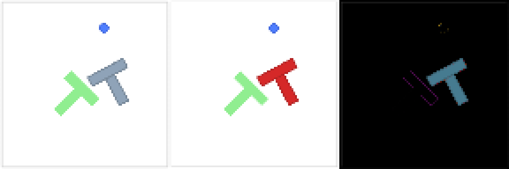
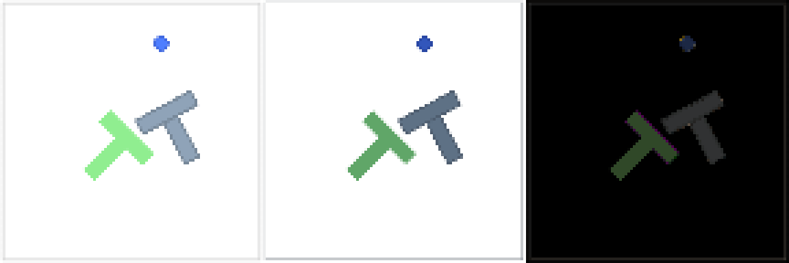

# Bitácora: qué pasa cuando se estropea la escena

## Qué es esto, y sobre todo qué no es

Esto **no es una medición y no entra en la memoria ni en el beamer**. Es una
observación: se cambia algo de la escena de Godot, se mira si la política sigue
resolviendo Push-T, y se anota. Un episodio por celda.

Tres razones para no tratar estos números como resultados, y conviene tenerlas
delante antes de mirar ninguna tabla:

1. **Un episodio por celda.** Tres semillas por condición no son una muestra.
2. **Los episodios no se repiten iguales.** Ya está medido en el módulo 07 del
   manual: la misma semilla, en la misma condición, con el mismo punto de
   control, dio 0,9726 en 183 pasos una vez y 0,9545 en 242 otra. El ruido de
   difusión sí está sembrado; lo que no es determinista son las convoluciones en
   GPU, y una simulación con contactos amplifica cualquier diferencia.
   Diferencias de centésimas entre celdas no significan nada.
3. **Las semillas están elegidas condicionando en el éxito** (ver más abajo), lo
   que sesga las líneas base al alza a propósito.

El resultado del TFM sigue siendo la pasada preregistrada sobre el bloque
disjunto `200000-200199`, en `logs_entrenamiento/prueba_final/`: V0 `0,872`,
V1 `0,649`, V2 `0,586`, V3 `0,578`, V4 `0,490`.

## La pregunta

La memoria compara cinco codificadores sobre una distribución de imágenes fija.
No dice nada sobre qué pasa si esa distribución cambia. Y hay una hipótesis
natural que cuesta poco mirar:

> **V3 congela DINOv2 ViT-S/14**, preentrenado sobre millones de imágenes
> naturales. **V0 es un ResNet-18 desde cero** que solo ha visto 90
> demostraciones de un renderizador concreto. Si el preentrenamiento compra
> invariancia, debería notarse al cambiar la apariencia — aunque V0 gane por
> mucho en la tarea sin perturbar.

Es una hipótesis, no una predicción con la que se pueda contrastar nada con tres
semillas. Lo que sigue es mirar, no medir.

**Adelanto, para que nadie lea las tablas buscando lo que no hay:** la hipótesis
no se sostiene. V3 no aguanta mejor que V0; aguanta peor, y además ya llega
tocada a la línea base porque no sobrevive al cambio de simulador. Y las dos se
caen del todo en cuanto se les cambia el color de la pieza.

## El montaje

- **Solo condición B.** Las perturbaciones cambian lo que dibuja Godot. En la
  condición A la imagen la produce `servidor/rasterizador_pusht.py` en Python con
  el código del entrenamiento, que no sabe nada de esto: la condición A es, por
  construcción, la escena sin perturbar. Está en las tablas como referencia.
- **La física nunca cambia.** Se perturba lo que la política ve, no lo que el
  mundo hace, para que cualquier degradación sea atribuible a la imagen.
- **El punto de control está congelado** y es el mismo que evalúa el preregistro:
  `epoch=0350-test_mean_score=0.865.ckpt` para V0 y
  `epoch=0100-test_mean_score=0.622.ckpt` para V3.

### Las semillas, y los dos filtros que hacen falta

Una perturbación solo se puede observar si hay sitio para caer: si la línea base
de una variante ya está en el suelo, no hay degradación que ver. De ahí el primer
filtro: **semillas que las dos variantes ya resuelven en el preregistro**. De las
200 del bloque disjunto, solo 20 tienen a V0 y a V3 en 1,000.

Ese filtro sesga las cifras absolutas al alza y hay que declararlo: **las líneas
base salen mucho mejores de lo que ninguna de las dos variantes es en general**.
Ver a V3 con una línea base alta aquí no contradice su 0,578 del preregistro; lo
explica el filtro. Lo único que estas tablas permiten leer es la **caída de cada
variante respecto de su propia línea base**, nunca la comparación en absoluto
entre variantes.

Hay un segundo filtro, y **costó un barrido entero descubrirlo**. La puntuación de
Push-T es el **máximo** de la cobertura a lo largo del episodio, y algunas
condiciones iniciales ya arrancan con la pieza parcialmente sobre el objetivo. Si
la política la empuja fuera y no la recupera, la puntuación del episodio acaba
siendo la de la pose de partida: **idéntica para todas las variantes e idéntica
para todas las perturbaciones**, porque el estado inicial lo sortea Python y es el
mismo para todas.

Fue exactamente lo que pasó en la primera tanda. La semilla 200007 arranca con
cobertura 0,665 y sus ocho celdas dieron el mismo `0,7002` hasta el último
decimal; la 200019 arranca en 0,373. Dos de las tres semillas elegidas no
llevaban información.

`servidor/elegir_semillas.py` cruza ahora los dos filtros y ordena por cobertura
inicial ascendente, para que no vuelva a pasar.

## Las perturbaciones

Cuánto se aleja la observación de la del renderizador original, medido con
`servidor/comparar_observacion.py` sobre la semilla 200051:

| Perturbación | Qué cambia | Píxeles con diferencia > 8 | Diferencia media |
|---|---|---|---|
| `ninguna` | nada; es la condición B tal cual | 2,7 % | 0,89 |
| `t_roja` | la pieza pasa de gris azulado a rojo | 5,4 % | 3,77 |
| `sombras` | la observación se renderiza iluminada | 11,8 % | 4,24 |

El 2,7 % de `ninguna` no es una perturbación: es lo que ya separa al renderizador
de Godot del de pygame, y sirve de suelo para las otras dos.

**`t_roja`.** Solo cambia el tono de la pieza. Para que sea un cambio de color y
nada más, el relleno se deriva del borde con el mismo aclarado que usa el
original (`min(1,2·c, 255)`, truncado), de modo que la relación entre los dos
tonos es la que la política vio en el entrenamiento. Base `firebrick`
(178, 34, 34) para el borde, (213, 40, 40) para el relleno. El objetivo sigue
verde y el agente azul.



**`sombras`.** Ningún color nominal cambia; cambian todos los píxeles. La cámara
de observación deja de usar materiales `SHADING_MODE_UNSHADED` y pasa a los
mismos materiales iluminados de la capa de la demostración, con luz direccional y
ambiente. Es la **ablación de la decisión de diseño que hizo viable la condición
B**: las dos capas de visibilidad separadas.



En los dos paneles: renderizador original, Godot, y el valor absoluto de la
diferencia.

## Cómo se reproduce

```powershell
# 0. elegir semillas: las que resuelven las dos variantes y no arrancan resueltas
.venv_diffuser_infer\Scripts\python.exe diffuser\godot\servidor\elegir_semillas.py `
    --variantes v0 v3 --cobertura-maxima 0.01 --cuantas 6

cd diffuser\godot

# 1. un episodio
.\lanzar.ps1 -Obs godot -Variante v3 -Perturbacion t_roja -Semilla 200051

# 2. ver lo que la politica recibe, sin gastar un episodio
.\lanzar.ps1 -Modo observacion -Obs godot -Perturbacion sombras -Semilla 200051
cd ..\..
.venv_diffuser_infer\Scripts\python.exe diffuser\godot\servidor\comparar_observacion.py `
    --godot diffuser\godot\grabaciones\observacion_v0_sombras_seed200051.png

# 3. ver los episodios: un GIF y una tira de 8 poses por grabacion
.venv_diffuser_infer\Scripts\python.exe diffuser\godot\servidor\ver_episodio.py --tira

# 4. las tablas
.venv_diffuser_infer\Scripts\python.exe diffuser\godot\servidor\resumen_grabaciones.py --markdown
```

Para volver a ver un episodio ya grabado en la escena 3D, sin GPU ni servidor:

```powershell
.\lanzar.ps1 -Modo reproducir -Obs godot -Variante v3 -Perturbacion t_roja -Semilla 200051
```

## Lo primero que salió no fue una perturbación

Antes de perturbar nada hay que comprobar que las dos variantes resuelven la
tarea en Godot sin perturbar. Esa criba, sobre cinco semillas limpias en las que
**V0 y V3 puntúan las dos 1,000 en la pasada preregistrada**, dio esto:

| semilla | V0, condición B | V3, condición B | preregistro (ambas) |
|---|---|---|---|
| 200023 | 0,9994 | 0,5304 | 1,0000 |
| 200024 | 0,9793 | 0,6440 | 1,0000 |
| 200051 | 1,0000 | 0,9656 | 1,0000 |
| 200072 | 0,9966 | 0,0062 | 1,0000 |
| 200079 | 1,0000 | 0,0000 | 1,0000 |
| **media** | **0,9951** | **0,4292** | 1,0000 |

**V3 no sobrevive al cambio de simulador.** En cinco condiciones iniciales que
resolvía perfectamente en pymunk, en Godot conserva una y falla o casi falla en
cuatro. V0, en las mismas cinco, no pierde nada apreciable.

Es un episodio por celda, así que ninguna casilla concreta es fiable. Pero la
diferencia entre `0,995` y `0,429` es de otro orden que el ruido de inferencia,
que en la misma semilla movía centésimas. Como efecto grueso, es el más limpio
que ha salido de todo este ejercicio, y no es el que se buscaba.

Tiene una consecuencia incómoda para el experimento que sí se buscaba: **a V3
apenas le queda línea base que degradar**. Las perturbaciones se corren de todos
modos sobre 200023, 200024 y 200051, y hay que leer la caída de cada variante
contra su propia línea base de esa misma semilla, nunca contra la otra variante.

### Por qué esto no contradice la memoria, y por qué tampoco la amplía

La memoria dice que V0 supera a V3 sobre el bloque disjunto, `0,872` frente a
`0,578`. Esto es coherente con aquello y va más allá en una dirección concreta:
la ventaja de V0 **crece** cuando cambia el motor y el renderizador. Pero no lo
demuestra. Son tres semillas, un episodio cada una, elegidas condicionando en el
éxito previo de ambas, y con dos factores cambiados a la vez (física y píxeles).
La fila de `tab:alcance` que dice que nada está demostrado fuera del simulador
sigue en pie tal cual está.

Lo que sí hace es sugerir que **la línea de trabajo futuro sobre robustez tiene
algo que encontrar**, y que el candidato natural no es el que uno esperaría: el
codificador preentrenado y congelado se comportó peor, no mejor, ante el cambio
de distribución.

## Resultados de las perturbaciones

Semillas 200023, 200024 y 200051; un episodio por celda; condición B.

### V0, ResNet-18 desde cero

| semilla | sin perturbar | `t_roja` | `sombras` | preregistro |
|---|---|---|---|---|
| 200023 | 0,9994 | 0,4063 | 0,0000 | 1,0000 |
| 200024 | 0,9793 | 0,0000 | 0,0000 | 1,0000 |
| 200051 | 1,0000 | 0,0000 | 0,3800 | 1,0000 |
| **media** | **0,9929** | **0,1354** | **0,1267** | 1,0000 |

### V3, DINOv2 ViT-S/14 congelada

| semilla | sin perturbar | `t_roja` | `sombras` | preregistro |
|---|---|---|---|---|
| 200023 | 0,5304 | 0,0000 | 0,0000 | 1,0000 |
| 200024 | 0,6440 | 0,0000 | 0,0000 | 1,0000 |
| 200051 | 0,9656 | 0,0000 | 0,0000 | 1,0000 |
| **media** | **0,7133** | **0,0000** | **0,0000** | 1,0000 |

### Qué se ve

**Las dos se caen, y se caen del todo.** No es una degradación graciosa: V0 pasa
de 0,99 a 0,13 y V3 de 0,71 a exactamente cero en las seis celdas perturbadas.
Con un episodio por celda no se puede afirmar que 0,135 sea distinto de 0,127,
pero sí que los dos son distintos de 0,99, que es la única comparación que aquí
tiene margen para sostenerse.

**Cambiar el color de la pieza basta.** `t_roja` no toca la geometría, ni la
física, ni el objetivo, ni el agente, ni el fondo; mueve el 5,4 % de los píxeles.
Y con eso la política deja de resolver la tarea. El codificador no ha aprendido
la forma en T: ha aprendido ese tono de gris azulado.

Cuánto de estrecha es esa dependencia está medido aparte, en
[barrido_color.md](barrido_color.md): la caída es **una pendiente y no un
acantilado**, correlaciona −0,97 con la distancia RGB, y un gris neutro degrada
tanto como un rojo situado a la misma distancia. No es que la política clasifique
por tono; es que tiene rasgos sintonizados en un punto del espacio de color y
pierde fiabilidad al alejarse en cualquier dirección. La tolerancia son unas 30
unidades RGB.

**`sombras` no cambia ningún color nominal y hace lo mismo.** Solo entra
iluminación. Confirma que la separación en dos capas de visibilidad —la
iluminada para el público, la plana para la política— no era un lujo de la
implementación: sin ella, la condición B no habría existido.

**El preentrenamiento congelado no compró invariancia.** Era la hipótesis de
partida y no se sostiene: V3 no aguanta mejor que V0, aguanta peor, y ya venía
peor de la línea base. Que DINOv2 haya visto millones de imágenes naturales no
ayuda cuando la cabeza de difusión que lo consume solo ha visto 90
demostraciones de un renderizador. Con dos variantes y tres semillas esto es una
observación, no un resultado — pero es una observación que apunta en contra de
lo que se esperaba, y esas son las que conviene anotar.


## Qué haría falta para que esto fuera una medición

El salto no es pequeño, y conviene que quede escrito para que nadie lo dé por
dado:

1. Las **200 condiciones** del bloque disjunto, no tres.
2. **Ruido común** entre celdas, como hace `diffuser/scripts/evaluar_bloque_test.py`,
   para que dos variantes ante la misma condición formen un par legítimo. Aquí el
   ruido se siembra por episodio pero no se alinea entre variantes ni entre
   perturbaciones.
3. **Semillas no condicionadas al éxito**, o un análisis que trate el filtro como
   parte del diseño.
4. **Las cinco variantes**, no dos: con V0 y V3 no se separa el efecto del
   preentrenamiento del de la arquitectura, porque cambian a la vez.
5. Un **preregistro** anterior a mirar los resultados, como el de
   `memoria/preregistro_prueba_final.md`.

Con eso sería un experimento de robustez publicable. Sin eso es lo que dice el
título: una bitácora.
