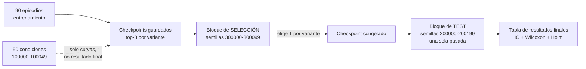

## Qué falla exactamente en C1

Conviene separar dos defectos que el informe mezcla bajo una sola etiqueta, porque **se arreglan con cosas distintas**:

**(i) Sesgo de selección (*winner's curse*).** El valor reportado es un máximo sobre $K$ evaluaciones ruidosas. Aunque las $K$ estimasen todas la misma cantidad verdadera, $\mathbb{E}[\max_k \hat{s}_k] > \max_k s_k$. Con los datos de [dispersion_puntuaciones.csv](memoria/datos/dispersion_puntuaciones.csv) el error estándar por evaluación es 0,040–0,059. Una cota heurística del optimismo es $\mathrm{SE}\cdot\mathbb{E}[\max_K Z]$: ≈0,08 con $K=10$ y ≈0,06 con $K=4$. Los checkpoints están correlacionados, así que el valor real es menor, pero el orden de magnitud es ese.

**(ii) Ausencia de test independiente.** Los mismos 50 episodios que eligieron el checkpoint producen la media, el IC y el p de Wilcoxon. La inferencia está condicionada a una búsqueda que el estadístico no modela.

El punto verdaderamente atacable en la defensa no es (i) ni (ii) por separado, sino **la asimetría**: V0 y V1 tuvieron 10 oportunidades, V2 seis, V3 y V4 cuatro. El sesgo optimista es mayor donde más oportunidades hubo, y eso empuja justo en la dirección de la conclusión principal. Cuantificado: el diferencial de optimismo entre $K=10$ y $K=4$ es del orden de 0,02–0,03, frente a una brecha V0−V4 de 0,329. Es decir:

- **La conclusión titular (V0 primero) sobrevive holgadamente al sesgo.**
- **Las conclusiones secundarias no.** V1 vs V2 son 0,020 de diferencia con optimismos distintos (K=10 vs K=6); ese contraste es puro ruido de selección.

Esto es buena noticia estratégica: la corrección de C1 casi con certeza confirma lo principal y disuelve lo accesorio, que es exactamente lo que el informe ya dice que no está demostrado.

---

## Nivel 0 — Mitigaciones de coste cero (con datos ya en disco)

Esto se puede hacer hoy, sin GPU, y ya elimina buena parte de (i).

### 0.1 Recuperar la matriz completa de puntuaciones por episodio

`PushTImageRunner` registra, en cada rollout, una clave por semilla del tipo `test/sim_max_reward_100000` … `test/sim_max_reward_100049`. Si están en los `logs.json.txt` comprimidos de [logs_entrenamiento/raw](logs_entrenamiento/raw), tienes una matriz $K \times 50$ por variante **ya guardada**. Verifícalo primero: es la pieza que habilita todo lo demás.

### 0.2 Comparación a época fija común (selección-libre)

La última época evaluada por las cinco variantes es la 150. Comparar los cinco checkpoints de la época 150 es una regla que **no depende de las puntuaciones observadas**: no hay máximo, no hay winner's curse, y las 50 semillas vuelven a ser legítimamente ajenas al ajuste de pesos, porque nada de lo que se hizo con ellas influyó en qué modelo se reporta. Es el arreglo más barato y más defendible que existe.

Ojo: si se elige 150 *porque* es donde V0 gana, se reintroduce el problema. Justifícalo por presupuesto común, no por resultado.

### 0.3 Igualar oportunidades

Repetir el análisis restringiendo todas las variantes a sus primeras cuatro evaluaciones (épocas 50, 100, 150, 200). Todas pasan a $K=4$; el sesgo deja de ser diferencial. Es un análisis de sensibilidad de una tabla.

### 0.4 Validación cruzada de la selección (split-half)

Con la matriz de 0.1 se estima el optimismo empíricamente:

1. Parte las 50 condiciones al azar en $A$ (25) y $B$ (25).
2. Elige el checkpoint que maximiza la media en $A$.
3. Reporta su media en $B$.
4. Repite sobre 1000 particiones y promedia.

La diferencia entre el máximo original y ese promedio **es** el optimismo de tu procedimiento, medido, no supuesto. Cuesta un script de 40 líneas y responde de frente a la pregunta del tribunal.

### 0.5 Promover un estimando que no sea el máximo

Ya tienes las columnas `media_ultimas_3` y `ultima_evaluacion`. Con ellas V0 sigue dominando (0,862 y 0,859, frente a 0,435–0,585). Declararlas endpoint primario y relegar el máximo a información secundaria elimina (i) casi por completo. Matiz que hay que reconocer: «últimas tres» depende de presupuestos desiguales, así que conviene reportar 0.2 y 0.5 juntas.

### 0.6 Reformular el lenguaje

Renombrar la Tabla 9 como «puntuación en el conjunto de selección (estimación optimista)», retirar la lectura confirmatoria de Wilcoxon/Holm y etiquetar el análisis como exploratorio. No arregla el diseño, pero elimina la afirmación falsa.

---

## Nivel 1 — Bloque de test disjunto (sin reentrenar)

Esta es la corrección que el informe pide en Prioridad 1.1, y es puramente coste de inferencia. La infraestructura ya existe: `v0_inference_utils.py` acepta `seeds=[...]` arbitrarias y los cinco checkpoints están en `diffuser/models/V{0..4}/`.

### Protocolo

1. **Preregistro antes de ejecutar nada.** Un fichero versionado en git (el timestamp del commit es la evidencia) que fije: bloque de semillas, $n$, endpoint primario, test estadístico, familia de multiplicidad, y la promesa explícita de no re-seleccionar después. Esto es literalmente lo que el evaluador exige como «evidencia necesaria».
2. **Bloque nuevo:** por ejemplo 200000–200199. Usa un offset distinto (no 100050) para que sea visualmente inconfundible en la memoria.
3. **Tamaño:** $n=200$. Con SD por episodio ≈0,35, SE ≈0,025; y para diferencias pareadas la SD es menor. $n=100$ es el mínimo aceptable; $n=200$ te da potencia para detectar 0,05.
4. **Una sola pasada.** Si haces un piloto sobre esas semillas, las quemas.
5. **Configuración del runner:** `n_test=200`, `test_start_seed=200000`, `n_train=0`, `n_test_vis=0` (nada de vídeo, es tiempo tirado), `n_envs=8`, pesos EMA.

### Coste

Un rollout de 56 condiciones con `n_envs=8` es lo que ya pagabas cada 50 épocas. 200 condiciones ≈ 4× eso, por 5 variantes ≈ 20 rollouts equivalentes. Mira el `train.log` de V0 para el tiempo real de un rollout y multiplica: está en el orden de horas, no de días. Es incomparablemente más barato que reentrenar.

### Aprovecha para matar M4 al mismo tiempo

Ya que vas a reejecutar, fija el generador de ruido de difusión por condición, **compartido entre variantes**:

```python
# mismo ruido de difusión para las 5 políticas en la misma condición -> par legítimo
gen = torch.Generator(device=device).manual_seed(base_seed + cond_idx)
```

Esto convierte la comparación en *common random numbers*: el par difiere solo por la política, la varianza de la diferencia pareada baja, Wilcoxon recupera su interpretación y la ejecución pasa a ser reproducible bit a bit. Dos hallazgos por el precio de uno.

Opcional si sobra cómputo: $R=3$ repeticiones de difusión por condición, promediando por condición. El estimando pasa a ser «puntuación esperada del checkpoint en esa condición», que es más limpio de defender.

---

## Nivel 2 — Protocolo anidado selección/test

Si quieres cerrar (i) y (ii) por completo sin reentrenar:



Coste: 15 checkpoints × 100 condiciones para selección, más 5 × 200 para test.

**Limitación que debes declarar tú mismo antes de que la declare el tribunal:** solo se guardaron los tres mejores checkpoints *según la métrica contaminada*. El conjunto de candidatos ya está prefiltrado, así que el protocolo anidado **acota** el sesgo residual pero no lo anula. Decirlo tú convierte una vulnerabilidad en una muestra de rigor.

---

## Nivel 3 — Fase 2, si hay presupuesto

Nada de lo anterior arregla M1: la unidad de replicación sigue siendo el episodio, no el entrenamiento. Las semillas 43 y 44 previstas en [CLAUDE.md](CLAUDE.md) sobre tres variantes darían $n=3$ entrenamientos por condición. Con eso el análisis correcto es: una puntuación final por (variante, semilla de entrenamiento), y el contraste sobre esas medias. Es poco, pero es la diferencia entre «no puedo estimar la variación entre entrenamientos» y «la estimo con tres réplicas y el IC es ancho».

Si no da tiempo, la alternativa honesta es la del informe: rebajar objetivo y conclusiones a estudio exploratorio.

---

## Cómo se refleja en la memoria

- Un diagrama del flujo entrenamiento → validación → selección → test (el evaluador lo pide explícitamente en Prioridad 3.7).
- Una tabla nueva de **resultados finales** sobre el bloque disjunto, separada de la tabla de selección, con encabezados que no se puedan confundir.
- Trasladar Wilcoxon + Holm a esa tabla, y solo a esa. Especificar de paso el método de IC (los actuales son media ± 1,96·SE, aproximación normal — compruébalo con los números de `dispersion_puntuaciones.csv`), el tratamiento de empates y ceros, y la corrección de continuidad. Eso cierra también M6.
- Mantener la Figura 2 como diagnóstico de trayectoria, dejando claro que es descriptiva.

---

## Trampas a evitar

1. **Mirar el bloque de test y luego cambiar de checkpoint.** Destruye toda la operación. Preregistra y respétalo.
2. **Elegir el $n$ después de ver los resultados.** Fíjalo antes.
3. **Escoger la época común porque favorece a V0.** Justifícala por presupuesto.
4. **Presentar el nuevo resultado como si validase todo.** Si la ordenación cambia, el resultado principal es el nuevo, no el viejo; escríbelo en el preregistro para poder decirlo en la defensa.
5. **Olvidar que el pool de checkpoints está contaminado.** Decláralo.

---

## Plan mínimo recomendado

Si solo puedes hacer una cosa: **Nivel 0.2 + 0.4 + Nivel 1**. Comparación a época fija común, cuantificación empírica del optimismo por split-half, y una única evaluación sobre 200 semillas nuevas con ruido de difusión sincronizado. Sin reentrenar, en el orden de horas de GPU, y desactiva el techo de 59/100 que el informe aplica por «el conjunto de selección se usó para producir los resultados principales».